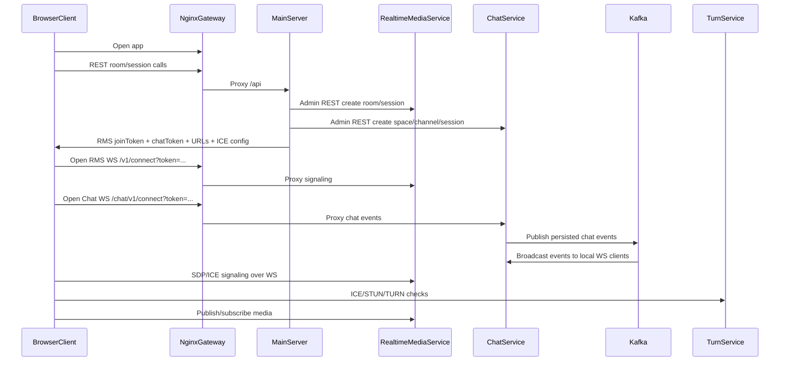

# Service Interactions

This page explains how services interact across control plane and media plane.

## Control plane and media plane

Kvatum now separates product orchestration from realtime media and chat runtimes:

- **main-server** owns product room APIs and talks to RMS through the Admin REST API.
- **RMS (Realtime Media Service)** owns volatile realtime state, signaling, WebRTC media routing, media slots and diagnostics.
- **Chat Service** owns chat spaces/channels/messages/reactions/read cursors and chat WebSocket fanout.
- **Browser SDKs** talk to RMS and Chat Service from the client and stay framework-agnostic so product apps can wrap them in MVVM/ViewModels.

| Plane         | Main channel                     | Purpose                                                                                    | Participants                     |
| ------------- | -------------------------------- | ------------------------------------------------------------------------------------------ | -------------------------------- |
| Control plane | HTTPS + WSS                      | Product room APIs, RMS/Chat admin calls, join token bootstrap, signaling/chat messages, diagnostics. | Browser, nginx, main-server, RMS, Chat |
| Media plane   | WebRTC (ICE/STUN/TURN, RTP/RTCP) | Real-time audio/camera/screen transport.                                                   | Browser, RMS, TURN               |
| Chat plane    | HTTPS + WSS                      | Messages, reactions, read cursors, attachments and link previews.                           | Browser, Chat Service, workers   |

## End-to-end flow: join room

## Interaction ownership table

| Interaction           | Owner (client)                    | Owner (server)                       | Contract source                       | Debug first                       |
| --------------------- | --------------------------------- | ------------------------------------ | ------------------------------------- | --------------------------------- |
| Room/session REST     | Webapp capabilities + features    | main-server HTTP/application         | Swagger/OpenAPI                       | main-server logs + `/api/swagger` |
| RMS Admin API         | main-server                       | RMS HTTP/application                 | RMS Admin REST contract               | main-server + RMS logs            |
| Chat Admin API        | main-server                       | Chat HTTP/application                | Chat Admin REST contract              | main-server + chat-server logs    |
| Signaling WS messages | RMS browser SDK                   | RMS signaling adapter/protocol       | SDK/RMS protocol contracts            | browser exported logs + RMS logs  |
| Chat WS messages      | Chat browser SDK                  | Chat WS/protocol                     | SDK/Chat protocol contracts           | browser exported logs + chat logs |
| Media routing         | RMS browser SDK media flows       | RMS media adapter/domain/application | WebRTC signaling + runtime invariants | RMS logs + client diagnostics     |
| TURN relay/fallback   | Browser ICE agent + webapp config | TURN + deploy config                 | deploy environment values             | turn/nginx/backend logs           |

## Common failure points

- `room-not-found` after backend restart (single-node, in-memory runtime).
- Chat storage misconfigured: `CHAT_STORAGE=postgres` requires Postgres migrations and `CHAT_POSTGRES_DSN`.
- Missing or invalid TURN/ICE env values for target network.
- WS signaling channel up, but negotiation fails due to SDP/ICE mismatch.
- Chat token missing/expired, so the room opens but chat panel stays disconnected.
- Browser permissions/device constraints before media publish.
